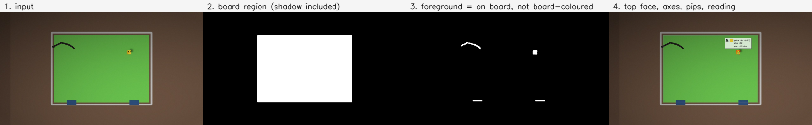
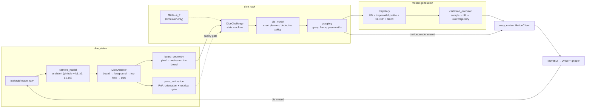
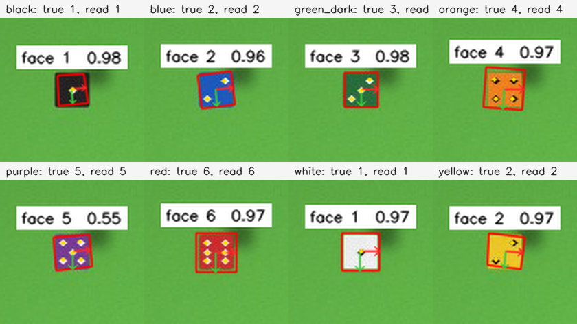
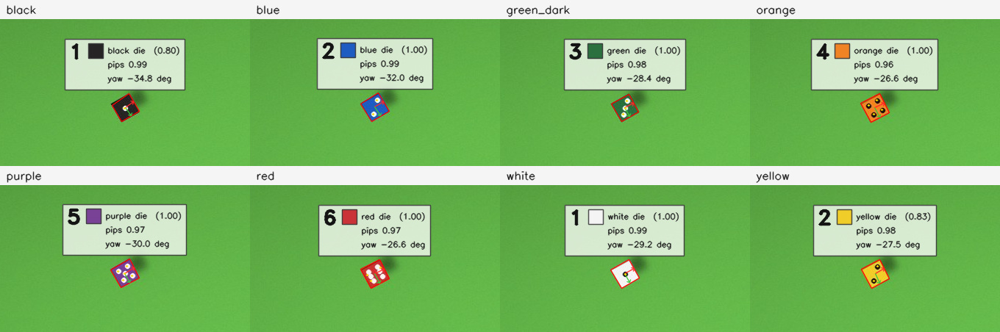
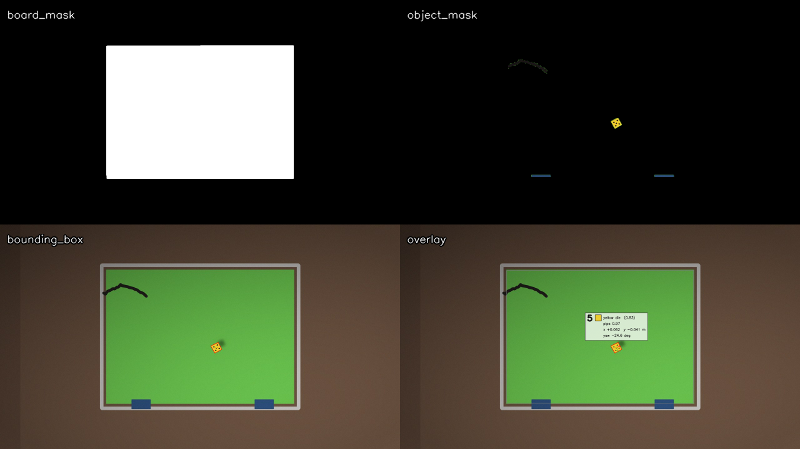
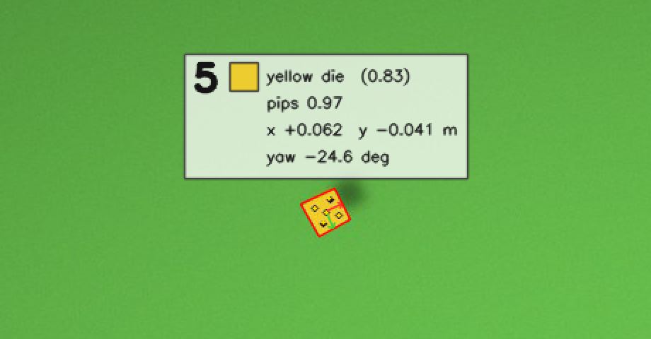
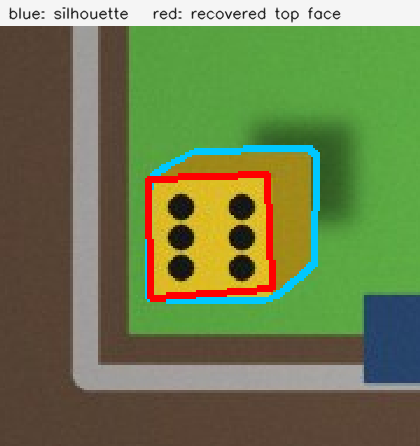

# DRIMS 2026 — Dice Challenge

A ROS 2 solution to the DRIMS Summer School challenge: **a UR5e must pick up a
die and re-orient it until a requested face is showing.** A camera above a green
board finds the die and reads its top face; a state machine decides which
re-grasp to make; `easy_motion`/MoveIt executes it; repeat until the requested
face is up.

Built against the school's own stack — [`drims_cells`], [`easy_motion`] and
[`drims2_dice_simulator`] — and running inside the [DRIMS2 Docker image].

<p align="center">
  
</p>

---

## What is actually solved here

The challenge decomposes into two problems that are interesting for different
reasons, and both are solved in **ROS-free, unit-tested Python** with a thin ROS
node wrapped around each:

| Problem | Module | Why it is not trivial |
| --- | --- | --- |
| Read the die | `dice_vision/detector.py` | The die's colour is not fixed, the board is unevenly lit, the die casts a hard shadow, and at 25 px across its pips touch. |
| Decide how to turn it | `dice_task/die_model.py` | A gripper coming from above can only rotate the die about a horizontal axis, and a single camera cannot see which lateral face is which. |
| Locate it in metres | `dice_vision/camera_model.py`, `board_geometry.py` | A single camera cannot measure range without a size prior, and at 25 px the size prior is 9 % out. |
| Move without stopping | `dice_task/trajectory.py` | MoveIt plans every pose request to a full stop, and the challenge is scored on cycle time. |
| Put the die back down | `dice_task/grasping.py` | A 90° flip rotates the *gripper* by 90° too, so a straight-down grasp finishes pointing sideways — with the gripper's own body where the board is. |

Everything else — the ROS nodes, launch files, parameters — is plumbing around
those.



---

## The perception problem

### Colour-agnostic by construction

The vision hands-on says the die is *"yellow (**maybe**)"*, and the school's own
final-setup photo shows black, blue, red, orange and green dice on one board. So
the detector never looks for the die's colour. It segments the **board** and
treats *everything on the board that is not board-coloured* as foreground.

The board's colour is not hard-coded either. A wide green window is used once to
locate the board, then the board's own median colour is measured from that
region and becomes the classifier. That matters for the one case a fixed hue
window cannot survive: **a green die on a green board.**

Classification uses **chromaticity** `(R, G) / (R+G+B)` rather than HSV value,
which buys the property that makes the whole thing work:

* a **shadow** on the board keeps the board's chromaticity → stays board;
* a **dark die** has a different chromaticity → becomes foreground.

One feature separates the two things that a brightness threshold cannot tell
apart. All eight dice below are found and read with the same parameters:

<p align="center">
  
</p>

### Naming the colour anyway

The colour is not *used* — but it is worth *saying*, because a wrong name is
visible at a glance where a wrong pose is not. So every detection carries the die's
body colour as a name, the HSV numbers behind it, and a confidence.

The body colour is read the way the hands-on session says to read colour: convert
to HSV and separate the two questions. **Saturation** answers "is there a hue at
all" — black, grey and white dice have no usable hue and are named from value
instead. **Hue** answers "which colour", and is largely invariant to the lighting
gradient and cast shadows that differ from board to board.

Two details earn their keep:

* **Hue is an angle, so the bands are arcs.** Red runs 170 → 8 *through zero* as a
  single band. Splitting it into `0..8` and `170..180` is the tempting shortcut,
  and it quietly ruins the confidence number: a perfect red sits at hue 179,
  which is mid-arc but hard against the edge of a half-band, so it would report
  as barely-red. Confidence is the distance to the nearer end of the arc, which
  is why a hue sitting between orange and yellow reports a low number instead of
  a confident wrong answer.
* **The body colour is the larger of two clusters — by shape, not by pixel
  count.** A die face is exactly two colours, so k-means with k=2 separates body
  from pips however many pips there are. But on a **six**, the pips cover more of
  the sampled area than the body between them, and a blue die with white pips
  duly reported "white" — only ever when the six was up. Picking the cluster with
  the largest *connected component* is immune: one pip is never bigger than the
  face around it.

384 renders — 8 colours × 6 faces × 8 placements — are named correctly, and the
per-colour sweep is a test (`test_every_palette_colour_is_named_correctly_on_every_face`).

<p align="center">
  
</p>

### Showing the work: one topic per stage

The vision hands-on builds the pipeline one published topic at a time — the
colour mask, then the oriented bounding box, then the position and axes — because
that is how you debug a vision node: you look at the stage where it *first* went
wrong instead of guessing from a wrong final number. Keeping that ability after
the pipeline works costs nothing, so all of it is published:

| topic | what it shows |
| --- | --- |
| `~/board_mask` | the segmented green board |
| `~/object_mask` | everything on the board that is not board-coloured, in its own colours rather than as a white blob — a mask that has quietly swallowed a shadow looks identical in binary and obvious in colour |
| `~/bounding_box` | the oriented bounding box and centre |
| `~/overlay` | the readout: face value, colour name **and swatch**, position on the board, yaw. Also published as `~/debug_image` |
| `~/mosaic` | all four tiled and labelled, so one rviz panel shows the whole pipeline |

Each is rendered only while something is subscribed.

<p align="center">
  
</p>

<p align="center">
  
</p>

Every image in this README is generated by `python3 scripts/make_docs_images.py`,
offline, from the code as it currently stands — so they cannot go stale.

### The die's silhouette is not its top face

Away from the image centre, a cube shows its side faces, so its blob is a
hexagon. Using it directly biases the die's centre towards the board centre and
feeds shaded side faces into the pip-reading patch.

Under a pinhole camera the silhouette is exactly the convex hull of the top face
and the bottom face translated towards the principal point — a Minkowski sum
with a segment. Intersecting the hull with a copy of itself shifted back by the
same vector returns the top face exactly:

```
hull = top ⊕ segment[-k·u, 0]
hull ∩ (hull + k·u) = top ⊕ ( segment[-k·u,0] ∩ segment[0,k·u] ) = top
```

and `k` comes free from the square's own symmetry — a square has equal extent
along any two perpendicular directions, so `k = extent(u) − extent(u⊥)`. No
camera calibration required. (`top_face_from_hull`)

<p align="center">
  
</p>

### Reading the face without segmenting the pips

The obvious approach — and the one the slides suggest (`findContours`,
`contourArea`) — is to count pip blobs. It does not hold up. The DRIMS die model
spaces pips 0.26 die-widths apart with a diameter of 0.21, so neighbouring pips
are **0.05 die-widths apart**: about one pixel on a 25 px die. They merge, the
count collapses, and face 6 fails first. In an early version this alone cost
**13 of 28** face errors.

So the face is read by sampling the nine cells of the pip grid and matching that
nine-vector against the six canonical layouts over all four 90° rotations.
Merged pips stop mattering because each cell is integrated rather than
segmented. Two details are load-bearing:

* **The grid scale is estimated once, before any layout is scored.** Letting
  each hypothesis pick its own scale is subtly wrong: layout `1` can shrink the
  grid until its eight "empty" cells slide off the real pips, inflating its
  score until it beats the truth. That is precisely how 3 and 5 were being read
  as 1, and 4 as 2. The scale is chosen instead by maximising the variance across
  the nine cells — a hypothesis-free criterion.
* **Each layout is scored against the other grid cells, not against the blank
  face.** Score against blank face and every hypothesis that is a *subset* of the
  truth scores nearly as well as the truth: 1 ⊂ 3 ⊂ 5, 2 ⊂ 4 ⊂ 6. Scoring pip
  positions against the other candidate pip positions penalises a missing pip
  and a spurious one alike.

Both polarities are tried, so black pips on a white die and white pips on a black
die run through the same code.

### Parallax

The camera sees the *top* face, one die-edge above the board, so back-projecting
that pixel onto the board plane places the die too far from the image centre. For
a 27 mm die under a 1 m camera that is ~2.7 % radially — around **9 mm** at the
edge of a 700 mm board, comfortably enough to miss a grasp. `HomographyMapper`
corrects it given the camera height; `test_parallax_correction_actually_helps`
pins the improvement.

The image→board homography calibrates itself from the board's own four corners,
so there is nothing to hand-click.

### The camera model, and why PnP is *not* used for position

`camera_model.py` implements the vision lecture's pinhole model directly —
projection in homogeneous coordinates, `P = K[R|t]`, the principal-point offset,
and the radial–tangential distortion of "non-ideal cameras". The forward model
has no closed-form inverse, so undistortion is a fixed-point iteration. It agrees
with OpenCV run to convergence to **1e-9**; OpenCV's *default* `undistortPoints`
stops after five iterations and is ~0.17 px out at the frame edge, which the test
suite asserts rather than glosses over.

With intrinsics in hand, the die's top face is a **square of known size**, which
is exactly the input to PnP. So the obvious move is to solve for the full 6-DoF
pose and be done. Measured against ground truth over 120 random scenes, that
turns out to be the wrong call:

| position estimator | median | p95 |
| --- | --- | --- |
| PnP, straight from the detector's quad | 14.6 mm | 46.7 mm |
| PnP, refined onto the known board plane | 3.4 mm | 6.6 mm |
| **homography onto the known board plane** | **1.5 mm** | **2.9 mm** |

PnP infers range from *apparent size*, and the size is the weak link: the die is
~25 px across and its quad comes from a morphologically processed blob, so it
runs about **9 % too large**, which lands directly as a 9 % range error. This is
the lecture's "distances are not perceivable any more" made concrete — one camera
cannot measure range without a size prior, and this prior is poor.

Two things follow, and both are in the code:

* `refine_pose_onto_plane` keeps PnP's *bearing* (well conditioned, set by the
  centroid) and replaces its *range* with the ray–plane intersection against the
  known board height. That alone recovers a factor of four.
* Even so, position comes from the homography, which depends only on the blob's
  centroid — an average over hundreds of pixels, far less sensitive to the
  segmentation bias than four corners are.

So PnP earns its place doing what it is good at: **orientation** (yaw to 1.4°
median) and a **reprojection residual that gates the whole detection**. If the
four corners are not a projected square to within 3 px, the service reports
failure instead of a confident wrong pose.

Getting this comparison right required fixing my own measurement first: an
earlier version scored PnP against an assumed nadir camera while the test scenes
tilt and offset it, which charged PnP for my bad extrinsics and made it look four
times worse than it is.

---

## The manipulation problem

### The only primitive that exists

A parallel-jaw gripper approaching from above can change which face points up in
exactly one way: close on two **opposite lateral** faces, lift, rotate the wrist
±90° about the horizontal axis through those two faces, put it down. The fingers
have to sit on the faces the rotation leaves in place, so **the grasp direction
and the rotation axis are the same thing**.

The die also rests at some yaw, and its lateral faces are square to the *die*,
not to the robot base. Everything is therefore planned in a **grasp frame**: the
base frame rotated about Z by the die's yaw. In that frame `"x"` and `"y"` mean
"close the fingers along X / along Y", and a single yaw rotation converts back.

Rotation happens **about the die's own centre**, not the tool flange — rotating
about the flange swings the die through a wide arc, which is the collision the
hands-on slides mark with a red cross.

### Two planners, because two situations

**`exact`** — In simulation the dice simulator publishes `face1..6_tf`. Those six
normals recover the die's full orientation, and a breadth-first search over the
four primitives returns the shortest plan. Measured over all 24 orientations ×
6 targets:

| | already up | a lateral face | the bottom face |
| --- | --- | --- | --- |
| re-grasps | 0 | 1 | 2 |

**Mean 1.0, hard cap of 2.**

**`deduce`** — On the real cell a single overhead camera sees the top face and
nothing else, so the orientation is unknown. The policy is the reasoning a person
uses on a real die, in three stages:

1. **Check the top.** If it already shows the target, leave the die alone.
2. **The target may be underneath.** Opposite faces sum to 7, so reading the top
   also reads the bottom. If the target is the bottom face, two quarter turns
   about the same axis bring it up — 180°, the shortest route from bottom to top.
3. **Otherwise it is one of the four sides.** Turn the die once by 90° to bring a
   side into view. That single probe is enough, and this is the part worth
   knowing: **a die is chiral.** 1, 2 and 3 run anticlockwise about their shared
   vertex, and no rotation turns a die into its mirror image, so the 24
   orientations produce 24 distinct `(top, one lateral)` pairs. One reading of a
   side face therefore pins down the *whole* configuration — where all six faces
   are — and the robot drives straight at the target from there.

Stages 2 and 3 issue the same instruction, so the implementation is short: probe
once, deduce everything, then call the exact planner.

| re-grasps | 0 | 1 | 2 | 3 |
| --- | --- | --- | --- | --- |
| cases (of 144) | 24 | 24 | 72 | 24 |
| the target was… | on top | the probed side | the bottom, or on the grasp axis | opposite the probed side |

**Mean 5/3 = 1.67, worst case 3.** It cannot be beaten without seeing more of the
die: the four sides are indistinguishable until one is turned up, and any first
probe leaves them at 1, 2, 2 and 3 turns. Seeing more is exactly what `exact`
does with the face frames.

> An earlier version of this policy walked the 4-cycle instead — turn, look,
> turn again, switch axis when the cycle is exhausted. It averaged 2.0 with a
> worst case of 4. Deducing the configuration from one probe rather than
> searching for the target removes a third of the arm motion, which on a cycle
> that takes ~30 s of robot time is the difference worth having.

`auto` (the default) picks `exact` when the face frames are there and falls back
to `deduce` when they are not, so the same node runs in simulation and on the
real robot.

### Putting the die back down

A 90° flip rotates the *tool* by the same 90° as the die, because the fingers
have to stay on the two faces the rotation leaves in place. Grasp straight down
and the flip therefore finishes with the gripper pointing **horizontally** — and
a horizontal gripper cannot be lowered to the board, because its own body arrives
first. In simulation that shows up as:

```
[move_group] Computed Cartesian path with 10 points (followed 75.000000% of requested trajectory)
[motion_server] Planning failed! Cartesian planner completed 0.75 of the trajectory, less than the threshold 0.99.
[dice_task] motion failed with MoveIt error 99999
```

Three quarters of the way down is precisely where the gripper reaches the board.
The pick was clean; there was simply nowhere to put the die.

The fix is to stop starting the turn from vertical. `grasp_tilt_deg: 45` leans the
gripper **−45°** to pick the die up and therefore **+45°** to set it down: the
90° excursion is centred on vertical instead of running from vertical to
horizontal, and neither end is anywhere near the board.

Replaying the exact pose from the failing run — die at `(-0.100, 0.650, 0.011)`,
yaw 28.6°, `rotate +90deg about X`:

| | approach after the flip | far end of the gripper body, at the place pose | retreat |
| --- | --- | --- | --- |
| `grasp_tilt_deg: 0` | `z = -0.000` — **horizontal** | `z = +0.015` — level with the board | nowhere: "back along the tool axis" is sideways |
| `grasp_tilt_deg: 45` | `z = -0.707` | `z = +0.107` — 10 cm clear | lifts to `z = 0.086` |

The board surface is at `z ≈ -0.002`. With no lean the gripper has to end up
*inside* it; with the lean it has 10 cm of room.

Leaning is free, geometrically: the fingers close along the grasp axis whatever
the roll about that axis, so they still land flat on the same two faces. Two
tests pin this down — `test_a_leaning_grasp_is_never_horizontal_at_either_end`
(which also asserts that the *untilted* grasp does end horizontal, so the bug
cannot come back unnoticed) and
`test_leaning_does_not_move_the_fingers_off_their_faces`.

### Reach is spent on orientation, not just position

Leaning the gripper is not free, and the bill arrives somewhere unexpected. An
arm's reach is quoted to its own **flange**; a 150 mm gripper is 150 mm the arm
does not have. So at a *fixed* grasp point, changing the tool's orientation
changes whether the pose is reachable at all — a 45° lean swings the flange
through more than 10 cm.

That bit the obvious stand-off. Backing off 10 cm *along the tool axis* is the
textbook pre-grasp — it slides the fingers on along their own length — but with
a lean it moves sideways as well as up, and sideways is the expensive direction:

| pre-grasp, same grasp pose | flange distance | of a UR5e's 850 mm |
| --- | --- | --- |
| 10 cm back along the tool axis | 0.847 m | **100 %** |
| 10 cm straight up | 0.789 m | 93 % |
| (the grasp itself) | 0.767 m | 90 % |

0.847 m is *nominally* inside the envelope and it still fails: at 99.6 %
extension the elbow is straight and the arm is at a singularity. MoveIt reports
it as `-31`, "no IK solution", on the free-space move — before the gripper has
gone anywhere, so there is nothing to watch and nothing to debug.

The stand-off is therefore **vertical**, which costs nothing: the open fingers
straddle the die along the grasp axis, so a vertical descent never touches it
however far the gripper leans. And because `-31` is so uninformative, the node
now measures the flange distance for every pose it is about to command and says
which one is out of range, in metres, before asking MoveIt.

Two smaller motion fixes came with it:

* **The wrist no longer takes the long way round.** A grasp and the same grasp
  rolled 180° about its own approach axis grip the same faces from the same
  direction, so both are valid — and handing the arm the wrong one costs a
  180° spin of the last joint before the gripper has even touched the die.
  `nearest_equivalent_grasp` looks up the current tool orientation from TF and
  picks whichever is nearer.
* **Approach and retreat follow the tool axis, not the vertical.** With a leaning
  grasp those are no longer the same direction, and retreating straight up drags
  a finger across the top face of the die.

### Generating the motion, not just requesting it

The planning lecture draws the industrial controller as a pipeline:

```
instruction stack → trajectory generation → inverse kinematics → axis controllers
     (>10 Hz)           (>100 Hz)               (>100 Hz)            (>1 kHz)
```

`trajectory.py` and `cartesian_executor.py` implement the middle two boxes rather
than delegating them:

* **Path** — the LIN primitive, `p(s) = p_a + s (p_b − p_a)/L`.
* **Profile** — the trapezoidal velocity profile, the minimum-time solution
  subject to `|ṡ| ≤ v_max` and `|s̈| ≤ a_max`, degenerating to the triangular
  case when the path is too short to reach `v_max` (the case that makes short
  approach moves jerk). The lecture's worked example — 2 m rest-to-rest at unit
  limits, 3 s — is a test.
* **Orientation** — SLERP, `Q(t) = Q_a (Q_a⁻¹ Q_b)^{s(t)}`, taking the short way
  round, and **synchronised in time** with the translation so the wrist stops
  turning exactly when the tool arrives. A wrist still turning after the fingers
  are down will clip the die.
* **Blending** — the blend radius, as a parabolic corner cut.

Why bother, when `move_to_pose` already works: **MoveIt plans every
`move_to_pose` to a full stop.** A re-grasp cycle is eight waypoints, so it pays
seven decelerations it does not need. Generating one trajectory across the whole
path and sending it as a single `JointTrajectory` keeps the tool moving:

| | duration | stops |
| --- | --- | --- |
| one `move_to_pose` per waypoint | 7.37 s | 8 |
| blended, single trajectory | **5.61 s** | 4 |

**−24 % on the cycle**, and cycle time is precisely what the challenge scores
(*"max number of dice rolls in 10 min"*).

Two honesty notes, both enforced by tests:

* **Some stops cannot be blended away.** A pick-and-place reverses direction at
  the grasp — down, then back up the same line, a 180° turn no radius can round.
  The model detects such *hard corners* and stops at them; the saving comes from
  the other corners. Blending a path and still stopping at every point is
  *slower*, and a test pins that too, because it is tempting to credit the wrong
  half of the change.
* **Corner speed is capped by lateral acceleration**, `v ≤ √(a_lat·R)`. A tighter
  blend must be taken slower — that is why a genuinely sharp corner admits no
  speed at all.

`motion_mode: trajectory` opts in. It **bypasses MoveIt's planning-scene
collision checks**, so it is off by default, and it refuses to execute a path
whose IK solutions jump between branches — the signature of an elbow flip that
would sweep the arm across the cell — falling back to the MoveIt path instead.

---

## Results

All figures are produced by `pytest`, on 200 randomised scenes with randomised
die colour, size (24–32 mm), position, yaw, camera height (0.85–1.25 m), camera
tilt, board shade, lighting gradient and direction, vignetting, shadow strength
and direction, sensor noise and JPEG quality.

| Metric | Result |
| --- | --- |
| Detection rate | **200 / 200** |
| Face-value accuracy | **197 / 200 (98.5 %)** |
| Face accuracy, deterministic 8 colours × 6 faces | **48 / 48** |
| Colour naming, 8 colours × 6 faces × 8 placements | **384 / 384** |
| Position error, median | **1.5 mm** |
| Position error, 95th percentile | **3.0 mm** (worst case 13.6 mm) |
| Planner correctness (exact + deduce), 24 orientations × 6 targets × 2 axes | **exhaustive, all pass** |
| Re-grasps needed, camera-only | **1.67 mean, 3 worst** (was 2.0 / 4) |
| PnP yaw error | **1.4° median, 5.0° p95** |
| Undistortion vs OpenCV run to convergence | **agrees to 1e-9** |
| Cycle time, blended vs stop-at-every-waypoint | **5.61 s vs 7.37 s (−24 %)** |
| Test count | **341 passing** |

Position error is measured end to end: detect the die, self-calibrate the
homography from the board corners, back-project with the parallax correction,
compare against ground truth in board coordinates.

### Running the tests

No ROS, no robot, no camera needed:

```bash
pip install opencv-python-headless numpy pytest
pytest                      # ~2 minutes
pytest tests/test_die_model.py -q     # planners only, <1 s
```

---

## Repository layout

```
src/dice_vision/
  dice_vision/detector.py             board/foreground segmentation, top-face
                                      recovery, pip-grid face reading,
                                      staged debug images                  (no ROS)
  dice_vision/colour.py               naming the die's body colour          (no ROS)
  dice_vision/camera_model.py         pinhole model, distortion, undistortion (no ROS)
  dice_vision/board_geometry.py       homography + pinhole pixel→metres     (no ROS)
  dice_vision/pose_estimation.py      PnP on the top face, plane refinement (no ROS)
  dice_vision/scene_simulator.py      renders board-and-die scenes           (no ROS)
  dice_vision/dice_vision_node.py     DiceIdentification service, 5 debug topics, TF
  dice_vision/fake_camera_node.py     synthetic camera, so vision runs in simulation
src/dice_task/
  dice_task/die_model.py              die algebra, exact planner, deductive policy (no ROS)
  dice_task/grasping.py               grasp frame, quaternions, rotation about a pivot (no ROS)
  dice_task/trajectory.py             LIN path, trapezoidal profile, SLERP, blending (no ROS)
  dice_task/cartesian_executor.py     sample → IK → JointTrajectory          (no ROS)
  dice_task/dice_task_node.py         the state machine
tests/                                341 tests, all offline
scripts/make_docs_images.py           regenerates every figure in this README
```

The split is deliberate: the nine modules marked *no ROS* contain all of the
reasoning and all of the failure modes, and can be run, tested and debugged on a
laptop in about two minutes.

---

## Running it

Clone this repository into `DRIMS2-2026/drims_ws/src`, then, **on the host**,
give the container write access to the workspace (this is what `setup.sh` in the
DRIMS2 repo does; it must be run *after* the files are in place):

```bash
cd ~/DRIMS2-2026
./setup.sh
sudo chgrp -R 42042 drims_ws bags && sudo chmod -R g+rwX drims_ws bags
./start.sh <YOUR-DOMAIN-ID>
```

Inside the container:

```bash
cd ~/drims_ws && colcon build --symlink-install && source install/setup.bash
ros2 pkg list | grep dice        # expect dice_task and dice_vision
```

> **Every new container shell needs `source ~/drims_ws/install/setup.bash`.**
> The DRIMS2 image adds that line to `/root/.bashrc` rather than to the `drims`
> user's, so it is never picked up automatically. Without it `ros2 launch
> dice_task ...` reports "package not found" even though the build succeeded.

Each terminal below is a separate `./connect.sh` from the host, followed by that
`source` line.

**Terminal 1 — the cell** (use the number of the cell you are on):

```bash
ros2 launch drims_description ur5e_1_start.launch.py fake:=true
```

**Terminal 2 — the die.** `selected_cell` must match the cell you launched: it
sets both the spawn bounds and the surface height, and it *overrides* any
`surface_height:=` you pass, so there is no point setting that by hand.

| cell | x range | y range | surface_height |
| --- | --- | --- | --- |
| 1 | −0.35 … 0.15 | 0.50 … 0.85 | −0.04 |
| 2 | −0.30 … 0.20 | 0.50 … 0.85 | −0.02 |
| 3 | −0.28 … 0.22 | 0.35 … 0.70 | −0.01 |
| 4 | −0.30 … 0.20 | 0.50 … 0.85 | −0.02 |

```bash
ros2 launch drims_dice_simulator spawn_dice.launch.py \
    selected_cell:=1 face_up:=5 position:="[-0.1, 0.65, -0.04]"
```

A position outside the selected cell's range kills the spawner immediately with
`Specified position [...] is outside the bounds`. The Z value is forgiving — it
is raised automatically to sit the die on the surface.

**Terminal 3 — the challenge:**

```bash
ros2 launch dice_task dice_challenge.launch.py target_face:=2
```

The node reports each step and finishes with a summary line:

```
[dice_task] face 5 is up (target 2, bottom 2)
[dice_task] plan: rotate +90deg about X [exact]
[dice_task] grasping at (0.600, 0.200, -0.027), yaw 0.0 deg, rotate +90deg about X
[dice_task] face 2 is up (target 2, bottom 5)
[dice_task] SUCCESS: face 2 up (target 2) after 1 re-grasp(s) in 12.4 s
```

### Running the perception in simulation

The DRIMS simulation has **no camera**. `ur5e_N_start.launch.py fake:=true` gives
you the arm and MoveIt, and `drims_dice_simulator` answers
`/dice_identification` from ground truth — there is no image anywhere, so the
detector has nothing to look at.

`fake_camera_node` fills that hole. It watches the simulated die (its face on
`/dice_face`, its pose on TF), renders the overhead view a camera above the board
*would* have seen, and publishes it as an ordinary `CompressedImage` +
`CameraInfo`. The rest of the chain is unchanged, so this exercises the real
detector, the real camera model and the real service:

```
dice simulator ─► fake camera ─► detector ─► pose ─► state machine ─► robot
      ▲                                                                 │
      └─────────────────────────────────────────────────────────────────┘
```

**Terminal 3 — synthetic camera + vision:**

```bash
ros2 launch dice_vision vision_in_simulation.launch.py
```

**Terminal 4 — look at what it sees:**

```bash
# rqt_image_view is not in the DRIMS image; rviz2 is. Add an Image display and
# set its topic to /dice_vision/mosaic -- that one topic carries all four
# pipeline stages tiled, so a single panel shows the whole chain. The individual
# stages are on /dice_vision/{board_mask,object_mask,bounding_box,overlay}.
rviz2

# or check the numbers without a GUI at all
ros2 service call /dice_vision/dice_identification easy_motion_msgs/srv/DiceIdentification "{}"
ros2 topic hz /dice_vision/overlay
```

The overlay carries the board outline, the fitted top-face quad, the die's axes,
the pip markers, and a card reading the face value, the die's **colour name and
a swatch of the pixels the name came from**, its position on the board in metres
and its yaw. The service log line says the same thing:

```
[dice_vision] yellow die, face 5 at (-0.100, 0.650) confidence 0.97
```

**Then drive the robot from the camera instead of from ground truth:**

```bash
ros2 launch dice_task dice_challenge.launch.py \
    target_face:=3 strategy:=deduce \
    identification_service:=/dice_vision/dice_identification
```

`strategy:=deduce` is the honest pairing: a camera sees only the top face, so this
is the policy the real cell would use.

**This is a simulated sensor, not a claim about the real one.** The renderer
models projection, perspective, an uneven lighting gradient, a cast shadow,
sensor noise and JPEG compression — but it cannot stand in for the real board's
lighting or the real lens. Running the detector on the provided bags is still the
honest final check.

### Testing different die colours and lenses

This is the point of the colour-agnostic design, and now it can be tested
end to end rather than only in the test-suite. Nothing else changes:

```bash
for c in yellow red blue green_dark orange black white purple; do
  ros2 launch dice_vision vision_in_simulation.launch.py die_colour:=$c
done
```

`green_dark` is the one worth watching — a green die on a green board, the case a
fixed hue threshold cannot survive. Watch `/dice_vision/overlay`: the readout
should name the colour you launched with, and the swatch beside the number is
the actual pixels the name was read from, so a wrong name is obvious rather than
plausible.

Other knobs, all live parameters on `/fake_camera`:

```bash
# a wide-angle lens with real barrel distortion
ros2 launch dice_vision vision_in_simulation.launch.py \
    dist_coeffs:="[-0.28, 0.09, 0.0, 0.0, 0.0]"

# harsh lighting and a strong cast shadow
ros2 launch dice_vision vision_in_simulation.launch.py \
    light_gradient:=0.45 shadow_strength:=0.6

# change the colour without restarting anything
ros2 param set /fake_camera die_colour blue
ros2 param set /fake_camera shadow_strength 0.7
```

### Running the generated trajectories

Everything above uses `motion_mode: moveit`, which plans each waypoint to a full
stop. To run the trajectory generator instead:

```bash
ros2 launch dice_task dice_challenge.launch.py target_face:=2 motion_mode:=trajectory
```

(`ros2 launch` takes launch *arguments*, `name:=value`. It has no `--ros-args`;
that is `ros2 run` syntax.)

Watch for the line it prints per segment:

```
[dice_task] executing 34 points over 1.68 s (2 stops, peak joint rate 1.21 rad/s)
```

If instead you see `trajectory rejected: ...`, it fell back to the MoveIt path
and told you why — an unreachable sample, or an IK branch change. That is the
intended behaviour, not a failure: the alternative is executing a joint path that
jumps.

> **`motion_mode: trajectory` bypasses MoveIt's planning-scene collision checks.**
> Get the task working in `moveit` mode first, keep the workspace clear, and be
> ready on the stop button the first time.

### Testing it properly

The point of the challenge is that it works from *any* start, not one:

```bash
# every starting face, for a fixed target
for f in 1 2 3 4 5 6; do
  ros2 service call /reset_dice std_srvs/srv/Trigger "{}"
  ros2 launch drims_dice_simulator spawn_dice.launch.py selected_cell:=1 face_up:=$f
  ros2 launch dice_task dice_challenge.launch.py target_face:=4
done

# force the camera-only policy, which is what the real cell would use
ros2 launch dice_task dice_challenge.launch.py target_face:=3 strategy:=deduce

# random position and face
ros2 launch drims_dice_simulator spawn_dice.launch.py \
    selected_cell:=1 random_position:=true face_up:=0
```

### Running the vision on the recorded bags

```bash
ros2 bag play -l <bag_folder>
ros2 launch dice_vision dice_vision.launch.py
# one rviz Image display on /dice_vision/mosaic shows all four stages at once
rviz2
ros2 service call /dice_identification easy_motion_msgs/srv/DiceIdentification "{}"
```

To drive the robot from the camera instead of from the simulator's ground truth,
point the task node at it:

```bash
ros2 launch dice_task dice_challenge.launch.py \
    target_face:=3 strategy:=deduce \
    identification_service:=/dice_vision/dice_identification
```

---

## Parameters worth knowing

| Parameter | Default | Notes |
| --- | --- | --- |
| `dice_task/strategy` | `auto` | `exact` needs `face1..6_tf`; `deduce` is camera-only. |
| `dice_task/gripper_close_axis` | `y` | Which **tool** axis the fingers close along. Wrong value ⇒ the die is grabbed on its corners. Quote it: YAML 1.1 reads a bare `y` as `true`. |
| `dice_task/grasp_tilt_deg` | `45` | How far the gripper leans off vertical to grasp. `0` restores a straight-down grasp, which **cannot put the die back down** after a 90° flip — see [Putting the die back down](#putting-the-die-back-down). |
| `dice_task/lift_height_m` | `0.12` | Lift before turning; too small clips the board. |
| `dice_task/reach_radius_m` | `0.850` | The arm's reach *to its flange*. Diagnostics only — turns MoveIt's `-31` into a message naming the pose and the distance. `0` disables. |
| `dice_task/tool_length_m` | `0.15` | Flange to fingertips. Read from TF when available; this is the fallback. |
| `dice_vision/board_origin_in_base` | `[0.60, 0.10, -0.01]` | Board centre in the base frame; Z is the cell's `surface_height`. |
| `dice_vision/camera_height_m` | `1.0` | Only used for the parallax correction. |
| `dice_vision/chroma_tolerance` | `0.055` | Raise if the die is being cut into pieces; lower if shadow leaks in. |
| `dice_vision/undistort` | `true` | Rectify using `CameraInfo`'s distortion before detecting. |
| `dice_vision/use_pnp_check` | `true` | Reject detections whose quad is not a projected square. |
| `dice_vision/min_face_confidence` | `0.25` | Below this the service reports failure rather than a guessed value. |
| `dice_task/motion_mode` | `moveit` | `trajectory` runs the generated path; ~24 % faster, but skips MoveIt's collision checks. |
| `dice_task/blend_radius_m` | `0.03` | Corner rounding. `0` disables blending. |
| `dice_task/lateral_a_max` | `2.0` | Caps the speed through a blended corner. |

---

## Troubleshooting

Integration problems hit while bringing this up on WSL2, and what they look like:

| Symptom | Cause | Fix |
| --- | --- | --- |
| `colcon build` → `PermissionError: [Errno 13] ... 'log'` | `drims_ws` is bind-mounted from the host and owned by your host user; the container runs as `drims` (uid 1001, group `drims2` gid 42042). | Run `setup.sh` on the host, then `sudo chgrp -R 42042 drims_ws bags && sudo chmod -R g+rwX drims_ws bags`. |
| Build succeeds, but `ros2 launch dice_task ...` says package not found | The image writes the `drims_ws` source line into `/root/.bashrc`, not the `drims` user's. | `source ~/drims_ws/install/setup.bash` in every container shell. |
| `Package 'drims_dice_simulator' not found`, search path is only `/opt/ros/humble` | You are on the WSL host, not in the container. | Prompt should read `drims@`, not `giacomo@`. `./connect.sh` first. |
| Spawner exits with `position ... outside the bounds` | The spawn position must lie inside the *active* cell's range. | Pick x/y from the table above — but note the row below: the active cell is whatever the YAML says, not what you pass. |
| `selected_cell:=N` on the command line does nothing | Bug in `drims_dice_simulator`'s launch file: the argument is declared as `selected_cell` but forwarded to the node under the name `cell_id`, so it is silently dropped. Passing `surface_height:=` does not help either — the cell block overwrites it inside `get_params`. | Copy `dice_spawner_parameters.yaml`, edit `selected_cell` in it, and pass `params_file:=/path/to/your.yaml`. Otherwise you always get cell 4 (x −0.30…0.20, y 0.50…0.85, surface −0.02). |
| Task node logs `cannot look up dice_tf: "base_link" ... does not exist` and drops to `deduce` | A TF listener only receives `/tf` while its node is being executed. | Fixed in `dice_task_node.main`: the node now runs in its own executor on a background thread, and `wait_for_tf` fails loudly instead of silently degrading. |
| RViz shows the cell but no die | The spawner died — check terminal 2, not RViz. | As above. |
| `Cartesian planner completed 0.75 of the trajectory` then `motion failed with MoveIt error 99999`, always on the *place* move after a clean pick | A 90° flip rotates the tool by the same 90° as the die, so a straight-down grasp finishes pointing horizontally — and a horizontal gripper cannot be lowered to the board, because its own body arrives first. 75 % of the descent is exactly where it gets to. | Fixed by `grasp_tilt_deg: 45`: lean −45° to pick up and +45° to put down, so the excursion is centred on vertical and neither end is horizontal. |
| `motion failed with MoveIt error -31` on the *first* move, before the arm goes anywhere | `-31` is "no IK solution". Almost always reach: the die can sit most of a metre from the base and the gripper adds another 150 mm past the flange. | The node now prints the flange distance and which pose exceeded it. Spawn the die closer to the base, or lower `grasp_tilt_deg`. |
| The wrist spins a half turn before touching the die | A grasp and the same grasp rolled 180° about its approach axis are equally valid, and the arm was handed whichever the maths produced first. | Fixed by `nearest_equivalent_grasp`, which reads the current tool orientation from TF and picks the nearer of the two. |
| `ros2 pkg executables dice_vision` lists only `dice_vision_node` | The workspace was built before `fake_camera_node` existed. | `colcon build --packages-select dice_vision --symlink-install` and re-source `install/setup.bash`. |

## Known limits

* **One die per board.** The detector returns the single most die-like blob. The
  course's multi-dice photo would need the scorer turned into a ranked list —
  the pipeline supports it, the service signature does not.
* **The deductive policy assumes a standard, right-handed die** (opposite faces sum to 7, and 1-2-3 anticlockwise about their vertex). Every
  die in the challenge is standard, and the exact planner does not need the
  assumption.
* **Grasp poses are not collision-checked against the board** beyond lifting
  before rotating; MoveIt does the rest — and in `motion_mode: trajectory` it
  does not, which is why that mode is opt-in.
* **The trajectory mode assumes the arm's joint limits are not the binding
  constraint.** The Cartesian profile is capped by Cartesian limits and the IK
  path is only checked for branch continuity, not against joint velocity limits;
  the controller will reject a trajectory that exceeds them.
* **Numbers above are from synthetic scenes.** The renderer is a real pinhole
  projection with the school's own die geometry, and it is deliberately harsher
  than the recorded bags in lighting and shadow, but it is not a substitute for
  the bags. Running the detector on the provided bags is the next validation
  step.

---

## Credits

Built on the DRIMS Summer School 2026 codebase by CNR-STIIMA-IRAS, Politecnico
di Milano and Università di Modena e Reggio Emilia:
[`drims_summerschool`], [`drims_cells`], [`easy_motion`], [`drims2_dice_simulator`],
[DRIMS2 Docker image].

[`drims_summerschool`]: https://github.com/CNR-STIIMA-IRAS/drims_summerschool
[`drims_cells`]: https://github.com/CNR-STIIMA-IRAS/drims_cells
[`easy_motion`]: https://github.com/CNR-STIIMA-IRAS/easy_motion
[`drims2_dice_simulator`]: https://github.com/CNR-STIIMA-IRAS/drims2_dice_simulator
[DRIMS2 Docker image]: https://github.com/AIRLab-POLIMI/DRIMS2-2026
