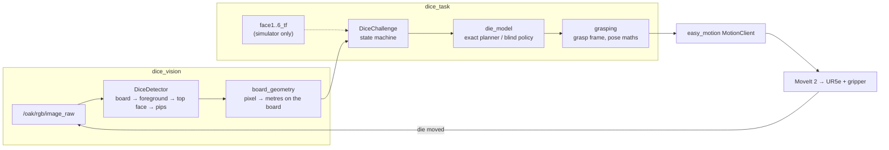

# DRIMS 2026 — Dice Challenge

A ROS 2 solution to the DRIMS Summer School challenge: **a UR5e must pick up a
die and re-orient it until a requested face is showing.** A camera above a green
board finds the die and reads its top face; a state machine decides which
re-grasp to make; `easy_motion`/MoveIt executes it; repeat until the requested
face is up.

Built against the school's own stack — [`drims_cells`], [`easy_motion`] and
[`drims2_dice_simulator`] — and running inside the [DRIMS2 Docker image].

<p align="center">
  
</p>

---

## What is actually solved here

The challenge decomposes into two problems that are interesting for different
reasons, and both are solved in **ROS-free, unit-tested Python** with a thin ROS
node wrapped around each:

| Problem | Module | Why it is not trivial |
| --- | --- | --- |
| Read the die | `dice_vision/detector.py` | The die's colour is not fixed, the board is unevenly lit, the die casts a hard shadow, and at 25 px across its pips touch. |
| Decide how to turn it | `dice_task/die_model.py` | A gripper coming from above can only rotate the die about a horizontal axis, and a single camera cannot see which lateral face is which. |

Everything else — the ROS nodes, launch files, parameters — is plumbing around
those two.



---

## The perception problem

### Colour-agnostic by construction

The vision hands-on says the die is *"yellow (**maybe**)"*, and the school's own
final-setup photo shows black, blue, red, orange and green dice on one board. So
the detector never looks for the die's colour. It segments the **board** and
treats *everything on the board that is not board-coloured* as foreground.

The board's colour is not hard-coded either. A wide green window is used once to
locate the board, then the board's own median colour is measured from that
region and becomes the classifier. That matters for the one case a fixed hue
window cannot survive: **a green die on a green board.**

Classification uses **chromaticity** `(R, G) / (R+G+B)` rather than HSV value,
which buys the property that makes the whole thing work:

* a **shadow** on the board keeps the board's chromaticity → stays board;
* a **dark die** has a different chromaticity → becomes foreground.

One feature separates the two things that a brightness threshold cannot tell
apart. All eight dice below are found and read with the same parameters:

<p align="center">
  
</p>

### The die's silhouette is not its top face

Away from the image centre, a cube shows its side faces, so its blob is a
hexagon. Using it directly biases the die's centre towards the board centre and
feeds shaded side faces into the pip-reading patch.

Under a pinhole camera the silhouette is exactly the convex hull of the top face
and the bottom face translated towards the principal point — a Minkowski sum
with a segment. Intersecting the hull with a copy of itself shifted back by the
same vector returns the top face exactly:

```
hull = top ⊕ segment[-k·u, 0]
hull ∩ (hull + k·u) = top ⊕ ( segment[-k·u,0] ∩ segment[0,k·u] ) = top
```

and `k` comes free from the square's own symmetry — a square has equal extent
along any two perpendicular directions, so `k = extent(u) − extent(u⊥)`. No
camera calibration required. (`top_face_from_hull`)

<p align="center">
  
</p>

### Reading the face without segmenting the pips

The obvious approach — and the one the slides suggest (`findContours`,
`contourArea`) — is to count pip blobs. It does not hold up. The DRIMS die model
spaces pips 0.26 die-widths apart with a diameter of 0.21, so neighbouring pips
are **0.05 die-widths apart**: about one pixel on a 25 px die. They merge, the
count collapses, and face 6 fails first. In an early version this alone cost
**13 of 28** face errors.

So the face is read by sampling the nine cells of the pip grid and matching that
nine-vector against the six canonical layouts over all four 90° rotations.
Merged pips stop mattering because each cell is integrated rather than
segmented. Two details are load-bearing:

* **The grid scale is estimated once, before any layout is scored.** Letting
  each hypothesis pick its own scale is subtly wrong: layout `1` can shrink the
  grid until its eight "empty" cells slide off the real pips, inflating its
  score until it beats the truth. That is precisely how 3 and 5 were being read
  as 1, and 4 as 2. The scale is chosen instead by maximising the variance across
  the nine cells — a hypothesis-free criterion.
* **Each layout is scored against the other grid cells, not against the blank
  face.** Score against blank face and every hypothesis that is a *subset* of the
  truth scores nearly as well as the truth: 1 ⊂ 3 ⊂ 5, 2 ⊂ 4 ⊂ 6. Scoring pip
  positions against the other candidate pip positions penalises a missing pip
  and a spurious one alike.

Both polarities are tried, so black pips on a white die and white pips on a black
die run through the same code.

### Parallax

The camera sees the *top* face, one die-edge above the board, so back-projecting
that pixel onto the board plane places the die too far from the image centre. For
a 27 mm die under a 1 m camera that is ~2.7 % radially — around **9 mm** at the
edge of a 700 mm board, comfortably enough to miss a grasp. `HomographyMapper`
corrects it given the camera height; `test_parallax_correction_actually_helps`
pins the improvement.

The image→board homography calibrates itself from the board's own four corners,
so there is nothing to hand-click.

---

## The manipulation problem

### The only primitive that exists

A parallel-jaw gripper approaching from above can change which face points up in
exactly one way: close on two **opposite lateral** faces, lift, rotate the wrist
±90° about the horizontal axis through those two faces, put it down. The fingers
have to sit on the faces the rotation leaves in place, so **the grasp direction
and the rotation axis are the same thing**.

The die also rests at some yaw, and its lateral faces are square to the *die*,
not to the robot base. Everything is therefore planned in a **grasp frame**: the
base frame rotated about Z by the die's yaw. In that frame `"x"` and `"y"` mean
"close the fingers along X / along Y", and a single yaw rotation converts back.

Rotation happens **about the die's own centre**, not the tool flange — rotating
about the flange swings the die through a wide arc, which is the collision the
hands-on slides mark with a red cross.

### Two planners, because two situations

**`exact`** — In simulation the dice simulator publishes `face1..6_tf`. Those six
normals recover the die's full orientation, and a breadth-first search over the
four primitives returns the shortest plan. Measured over all 24 orientations ×
6 targets:

| | already up | a lateral face | the bottom face |
| --- | --- | --- | --- |
| re-grasps | 0 | 1 | 2 |

**Mean 1.0, hard cap of 2.**

**`blind`** — On the real cell a single overhead camera sees the top face and
nothing else, so the orientation is unknown. The policy exploits the two facts
that *are* known: opposite faces sum to 7, and a quarter turn about a fixed axis
permutes the four faces not on that axis in a 4-cycle while pinning the two that
are. After a single turn the robot has seen two tops, `f` and `g`, and therefore
knows the whole cycle `{f, 7−f, g, 7−g}` — so it knows immediately whether to
keep turning or to switch grasp axis.

| re-grasps | 0 | 1 | 2 | 3 | 4 |
| --- | --- | --- | --- | --- | --- |
| cases (of 144) | 24 | 24 | 48 | 24 | 24 |

**Mean exactly 2.0, worst case 4** — and that mean is not an artefact of this
policy. Alternating the grasp axis instead of exhausting one costs the same 2.0,
because with only the top face observable the four lateral faces are
indistinguishable and any policy pays `(1+2+3+4)/4` to disambiguate them.
Beating it requires more information, which is exactly what `exact` uses.

`auto` (the default) picks `exact` when the face frames are there and falls back
to `blind` when they are not, so the same node runs in simulation and on the real
robot.

---

## Results

All figures are produced by `pytest`, on 200 randomised scenes with randomised
die colour, size (24–32 mm), position, yaw, camera height (0.85–1.25 m), camera
tilt, board shade, lighting gradient and direction, vignetting, shadow strength
and direction, sensor noise and JPEG quality.

| Metric | Result |
| --- | --- |
| Detection rate | **200 / 200** |
| Face-value accuracy | **197 / 200 (98.5 %)** |
| Face accuracy, deterministic 8 colours × 6 faces | **48 / 48** |
| Position error, median | **1.5 mm** |
| Position error, 95th percentile | **3.0 mm** (worst case 13.6 mm) |
| Planner correctness (exact + blind), 24 orientations × 6 targets × 2 axes | **exhaustive, all pass** |
| Test count | **159 passing** |

Position error is measured end to end: detect the die, self-calibrate the
homography from the board corners, back-project with the parallax correction,
compare against ground truth in board coordinates.

### Running the tests

No ROS, no robot, no camera needed:

```bash
pip install opencv-python-headless numpy pytest
pytest                      # ~2 minutes
pytest tests/test_die_model.py -q     # planners only, <1 s
```

---

## Repository layout

```
src/dice_vision/
  dice_vision/detector.py          board/foreground segmentation, top-face
                                   recovery, pip-grid face reading  (no ROS)
  dice_vision/board_geometry.py    homography + pinhole pixel→metres  (no ROS)
  dice_vision/dice_vision_node.py  DiceIdentification service, debug image, TF
src/dice_task/
  dice_task/die_model.py           die algebra, exact planner, blind policy (no ROS)
  dice_task/grasping.py            grasp frame, quaternions, rotation about a pivot (no ROS)
  dice_task/dice_task_node.py      the state machine
tests/                             159 tests; synthetic.py renders the scenes
scripts/make_docs_images.py        regenerates every figure in this README
```

The split is deliberate: the four modules marked *no ROS* contain all of the
reasoning and all of the failure modes, and can be run, tested and debugged on a
laptop in under two minutes.

---

## Running it

Inside the DRIMS2 container, with this repository cloned into `drims_ws/src`:

```bash
cd ~/DRIMS2-2026 && ./start.sh <YOUR-DOMAIN-ID>
cd ~/drims_ws && colcon build --symlink-install && source install/setup.bash
```

**Terminal 1 — the cell** (pick the cell number that matches your setup):

```bash
ros2 launch drims_description ur5e_1_start.launch.py fake:=true
```

**Terminal 2 — the die.** `surface_height` is per cell: `-0.04`, `-0.02`,
`-0.01`, `-0.02` for cells 1–4.

```bash
ros2 launch drims_dice_simulator spawn_dice.launch.py \
    face_up:=5 position:="[0.6, 0.2, 0.0]" surface_height:=-0.04
```

**Terminal 3 — the challenge:**

```bash
ros2 launch dice_task dice_challenge.launch.py target_face:=2
```

The node reports each step and finishes with a summary line:

```
[dice_task] face 5 is up (target 2, bottom 2)
[dice_task] plan: rotate +90deg about X [exact]
[dice_task] grasping at (0.600, 0.200, -0.027), yaw 0.0 deg, rotate +90deg about X
[dice_task] face 2 is up (target 2, bottom 5)
[dice_task] SUCCESS: face 2 up (target 2) after 1 re-grasp(s) in 12.4 s
```

### Testing it properly

The point of the challenge is that it works from *any* start, not one:

```bash
# every starting face, for a fixed target
for f in 1 2 3 4 5 6; do
  ros2 service call /reset_dice std_srvs/srv/Trigger "{}"
  ros2 launch drims_dice_simulator spawn_dice.launch.py face_up:=$f
  ros2 launch dice_task dice_challenge.launch.py target_face:=4
done

# force the camera-only policy, which is what the real cell would use
ros2 launch dice_task dice_challenge.launch.py target_face:=6 strategy:=blind

# random position and face
ros2 launch drims_dice_simulator spawn_dice.launch.py random_position:=true face_up:=0
```

### Running the vision on the recorded bags

```bash
ros2 bag play -l <bag_folder>
ros2 launch dice_vision dice_vision.launch.py publish_mask:=true
ros2 run rqt_image_view rqt_image_view /dice_vision/debug_image
ros2 service call /dice_identification easy_motion_msgs/srv/DiceIdentification "{}"
```

To drive the robot from the camera instead of from the simulator's ground truth,
point the task node at it:

```bash
ros2 launch dice_task dice_challenge.launch.py \
    target_face:=3 strategy:=blind \
    identification_service:=/dice_vision/dice_identification
```

---

## Parameters worth knowing

| Parameter | Default | Notes |
| --- | --- | --- |
| `dice_task/strategy` | `auto` | `exact` needs `face1..6_tf`; `blind` is camera-only. |
| `dice_task/gripper_close_axis` | `y` | Which **tool** axis the fingers close along. Wrong value ⇒ the die is grabbed on its corners. |
| `dice_task/lift_height_m` | `0.12` | Lift before turning; too small clips the board. |
| `dice_vision/board_origin_in_base` | `[0.60, 0.10, -0.01]` | Board centre in the base frame; Z is the cell's `surface_height`. |
| `dice_vision/camera_height_m` | `1.0` | Only used for the parallax correction. |
| `dice_vision/chroma_tolerance` | `0.055` | Raise if the die is being cut into pieces; lower if shadow leaks in. |

---

## Known limits

* **One die per board.** The detector returns the single most die-like blob. The
  course's multi-dice photo would need the scorer turned into a ranked list —
  the pipeline supports it, the service signature does not.
* **The blind policy assumes a standard die** (opposite faces sum to 7). Every
  die in the challenge is standard, and the exact planner does not need the
  assumption.
* **Grasp poses are not collision-checked against the board** beyond lifting
  before rotating; MoveIt does the rest.
* **Numbers above are from synthetic scenes.** The renderer is a real pinhole
  projection with the school's own die geometry, and it is deliberately harsher
  than the recorded bags in lighting and shadow, but it is not a substitute for
  the bags. Running the detector on the provided bags is the next validation
  step.

---

## Credits

Built on the DRIMS Summer School 2026 codebase by CNR-STIIMA-IRAS, Politecnico
di Milano and Università di Modena e Reggio Emilia:
[`drims_summerschool`], [`drims_cells`], [`easy_motion`], [`drims2_dice_simulator`],
[DRIMS2 Docker image].

[`drims_summerschool`]: https://github.com/CNR-STIIMA-IRAS/drims_summerschool
[`drims_cells`]: https://github.com/CNR-STIIMA-IRAS/drims_cells
[`easy_motion`]: https://github.com/CNR-STIIMA-IRAS/easy_motion
[`drims2_dice_simulator`]: https://github.com/CNR-STIIMA-IRAS/drims2_dice_simulator
[DRIMS2 Docker image]: https://github.com/AIRLab-POLIMI/DRIMS2-2026
